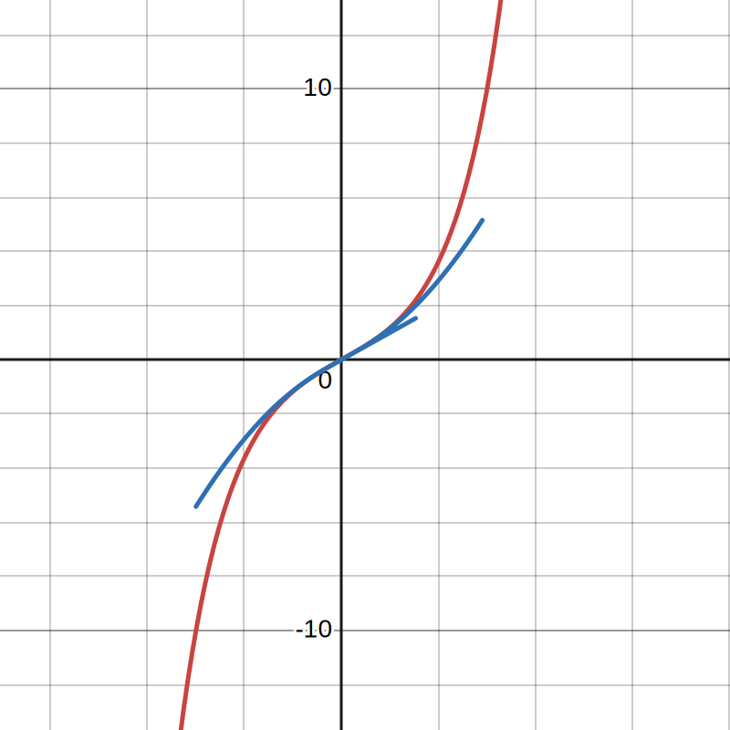

# Реализация функций описания угла

В `PDF` документах описано более подробно каким образом
и на каких основаниях работает алгоритм рассчета функций.

[Выражение бесконечной цепной дроби для аппроксимации функции sin(x)](sin.pdf)

### Функция `sin(x)` и апроксимация бесконечных цепных дробей

Использование цепных дробей для вычисления тригонометрических функций, мне показалось довольно интересным подходом. Может ли он привести к более эффективным алгоритмам и лучшей точности или нет, я не знаю, но как я замечал, в основном результаты, связанные с постоянной $\pi$, и как мне известно, все в итоге представляются в виде иррациональных чисел.

### Иррациональные числа

Типичные представители множества иррациональных чисел $I$
в виде десятичных дробей выглядят как уму непостижимая последовательность или случайный набор цифр их дробной части. По этой причине скорее всего
и было принято решение использовать специфическую операцию как взятие корня $n$ (пусть $n = 2$) степени из числа как специфический символ $\sqrt{x}$.
Однако, можно попытаться представить иррациональное число в виде обыкновенной дроби. Например $\sqrt{2}$
Квадратный корень из 2 представляется в виде цепной дроби как 
[1; 2, 2, 2, 2, ...]. Это означает, что дробь общего вида выглядит вот так:

$$\sqrt{2} = 1 + \frac{1}{2 + \frac{1}{2 + \frac{1}{2 + \dots}}}$$ 

### В итоге
В сети существуют материалы по разложению синуса на бесконечные цепные дроби,
но я принял вызов и решил апроксимировать функции самостоятельно. Это наверное мой первый опыт, попытаться собрать что-то из ничего самому,
практически не прибегая к уже готовым работам. Возможно снимки экрана электронной доски я выложу здесь тоже. 


### Результаты для синуса
Для хода в 0.1 для разложения бесконечной цепной дроби, функция с учетом разницы между эталонными значениями в $10^{-10}$ представлен график из [desmos](https://desmos.com)

 

Ниже указана функция, которая рисует таблицу определения и значения функции.
```cpp
/// Creates table of sine values using
/// infinite continued-fractions approximation
/// more information see in main.pdf or sin.pdf
/// or inside Chained class you see info
/// about how it works...
/// I've written there my calculates
/// and minds about this way to draw sin(x).
/// \param a start of distance
/// \param b end of distance
/// My "Iterations Count" equals 20 => 
/// fraction's levels are about 20 or 21. 
/// \return
int count_sin(double a, double b) {
    auto *cInstance = new Chained(iteratesCount /*20*/);
    double x = a, dx = 0.1;
    while (x < b) {
        std::cout << cInstance->sh2(x) << std::endl;
        x += dx;
    }

    delete cInstance;
    return 0;
}
```

# Результаты для гиперболического синуса
Так же укажу результат нелинейной аппроксимации снимком из [desmos](https://desmos.com) и приведу функцию, которая рисует таблицу значений и таблицу "эталонных" значений для данной операции. 


Функция вывода таблицы практически идентична предыдущей, с целью сохранить
сохранить понимание "что здесть произошло...?"

```cpp
/// Creates table of calues using
/// exponential (standard) view of
/// sh(x) and continued fractions view of it
/// use start and end parameters for draw
/// Exponential::sh(x) | Chained::sh(x)
/// \param a start of distance
/// \param b end of distance
/// \return
void count_sinh(double a, double b) {
    auto *cInstance = new Chained(iteratesCount);
    double x = a, dx = 0.1;
    while (x < b) {
        std::cout << Exponential::sh(a) << '\t' << cInstance->sh2(a) << std::endl;
        x += dx;
    }
    delete cInstance;
}
```
